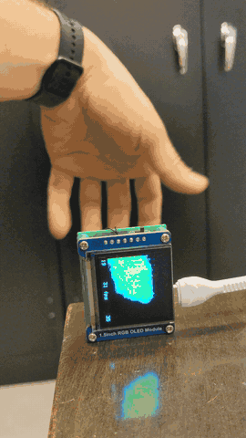
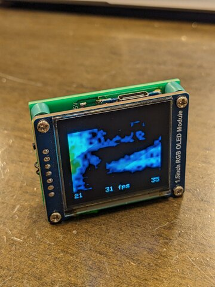
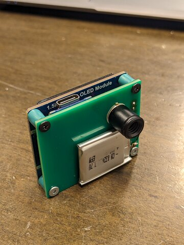

# Fast (about 32 fps) MLX90640 Thermal Camera for the RP2040-Zero

A fast Thermal Imaging Camera using the MLX90640 sensor and a 1.5 inch RGB OLED Display Module.

> **This is a fork.** The original project is
> **[weinand/thermal-imaging-camera](https://github.com/weinand/thermal-imaging-camera)**
> by **André Weinand**, who designed the two-core pipeline, the integer bilinear
> interpolation, the heat-map generation and the SSD1351 driver that this all still
> rests on. All of the architecture is his. This fork adapts it to different
> hardware and tunes the performance — see [Differences from upstream](#differences-from-upstream).

## Hardware

> **This fork targets the [Waveshare RP2040-Zero](https://www.waveshare.com/rp2040-zero.htm),
> not the Raspberry Pi Pico the original was built for.** The two are not
> pin-compatible for this project. See the wiring below before building.

- **Waveshare RP2040-Zero**
- MLX90640 Thermal Camera Breakout (55º or 110º), e.g. [Pimoroni](https://shop.pimoroni.com/products/mlx90640-thermal-camera-breakout)
- 1.5inch RGB OLED Display Module, 65K RGB Colors, 128×128, SPI, e.g. [Waveshare](https://www.waveshare.com/1.5inch-rgb-oled-module.htm)
- 2 × 5 kΩ resistors for the I2C pull-ups (**required** — see below)

### Wiring

Connect the MLX90640 and the OLED to 3.3 V.

| MLX90640 | RP2040-Zero | GPIO |
| -------- | ----------- | ---- |
| SDA      | I2C0 SDA    | 0    |
| SCL      | I2C0 SCL    | 1    |

| OLED | RP2040-Zero | GPIO |
| ---  | ----------- | ---- |
| DC   | SPI1 DC     | 9    |
| CLK  | SPI1 SCK    | 10   |
| DIN  | SPI1 TX     | 11   |
| CS   | SPI1 CSn    | 13   |
| RST  | RST         | 15   |

The OLED pins are unchanged from upstream. **The I2C pins are not:** upstream uses
GPIO 16/17, which does not work on an RP2040-Zero because **GPIO 16 is the board's
onboard WS2812 RGB LED**. Driving I2C there feeds the LED garbage and never reaches
the sensor. I2C moves to GPIO 0/1.

GPIO 0/1 are also UART0 TX/RX, so **stdio over UART must stay disabled** or the two
fight over the pin mux. This fork uses USB stdio instead.

### I2C pull-ups are not optional

Fit **5 kΩ pull-ups from GPIO 0 and GPIO 1 to 3.3 V** (2.2 kΩ is better if you have
it). The RP2040's internal pull-ups are ~50 kΩ, which gives roughly 1270 ns edges —
worse than even 100 kHz I2C permits, while this code clocks the bus at 1 MHz. Without
external pull-ups the sensor returns corrupt frames (`MLX90640_GetFrameData` → `-8`)
several times a minute.

Adding them took this camera from 26 to 31 fps and eliminated the errors entirely.

## Features

- **about 32 fps** — the MLX90640's own ceiling at a 32 Hz refresh rate. The sensor
  delivers a subpage every 31.25 ms and the pipeline now keeps up with it, so the
  camera is paced by the sensor rather than by its own work
- **53 ms** end-to-end latency, sensor-ready to pixels lit
- **82 ms** boot to first frame
- both cores of the RP2040 in a pipeline:
  - core0 fetches pages from the MLX90640 and scales them to 8-bit indices
  - core1 renders via bilinear interpolation and pushes to the OLED over SPI + DMA
- configurable heat map
- optional temporal smoothing over N frames (`SMOOTH_FRAMES`, disabled by default)

## Differences from upstream

Beyond the pin remapping and pull-ups above:

| Change | Effect |
| ------ | ------ |
| Single-precision radiometry (`MLX90640_fast.cpp`) | `CalculateTo` 19.3 → 10.7 ms |
| Frame buffers released after the SPI push, not before | latency 118 → 86 ms |
| SPI clock 10 → 16 MHz, framebuffer pushed by DMA | SPI 34.9 → 19.9 ms |
| Text banner refreshed ~3×/s instead of every frame | SPI 19.9 → 15.4 ms |
| Sensor probed at boot instead of a fixed 540 ms sleep | boot 597 → 82 ms |
| Image rendered at a true 4:3 128×96, centred | upstream stretched it vertically |
| Interpolation tables use a `DST-1` denominator | the outermost sensor row and column reached only 27% and 76% weight before |
| Image orientation corrected | upstream's flip settings are 180° out on this build |
| Touch buttons removed | the pins are unwired here; left floating with edge interrupts they trip at random |

Upstream's own measurements were 23 fps on a Pico; the 21 fps baseline this fork
started from was measured on this hardware, as were all the figures above.

Why single precision: upstream calls the Melexis driver's `MLX90640_CalculateTo`,
which is written against double literals (`SCALEALPHA` is `0.000001`, the Kelvin
offsets are `273.15`) and calls the double `sqrt`. On a Cortex-M0+ with no FPU the
entire per-pixel chain therefore runs in software double precision — to produce a
value that is then quantised to one of 256 palette steps. `MLX90640_fast.cpp`
computes the identical expressions in `float`.

## Code based on

- unmodified Melexis Driver: https://github.com/melexis/mlx90640-library/
- heat map code inspired by: http://www.andrewnoske.com/wiki/Code_-_heatmaps_and_color_gradients
- the [Pico SDK](https://www.raspberrypi.com/documentation/microcontrollers/c_sdk.html)
- the original camera, pipeline and display driver by
  [André Weinand](https://github.com/weinand/thermal-imaging-camera)

## Building

- make sure the "[Pico SDK](https://www.raspberrypi.com/documentation/microcontrollers/c_sdk.html)"
  is installed and `PICO_SDK_PATH` refers to it
- `git clone https://github.com/stanelie/thermal-imaging-camera`
- `cd thermal-imaging-camera`
- `git submodule init`
- `git submodule update`
- `cmake -S . -B build -DCMAKE_BUILD_TYPE=Release`
- `cmake --build build`

Flash `build/thermocam.uf2` by holding BOOTSEL while connecting USB and copying it
to the RPI-RP2 drive, or with `picotool load -x build/thermocam.uf2`.

`PROFILE` in `main.cpp` (on by default) prints per-stage timings over USB serial
once a second, which is how every number above was measured.

## Images

